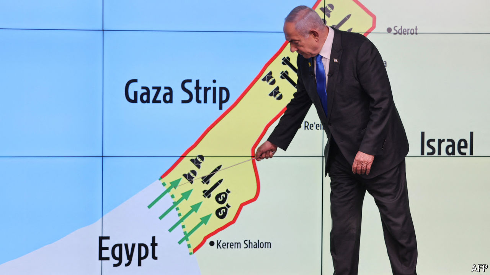

###### The Philadelphi story

# A narrow corridor in Gaza has become an obstacle to a ceasefire 

##### Binyamin Netanyahu says the presence of Israeli troops is crucial. His generals disagree 

 

> Sep 9th 2024 

ON ISRAELI tactical maps the narrow corridor along the border between the Gaza Strip and Egypt is code-named “Philadelphi”. It is a rubble-strewn wasteland, just 14km long and around a kilometre wide. And yet it has become one of the main obstacles to a ceasefire agreement which could perhaps end the war in Gaza.

