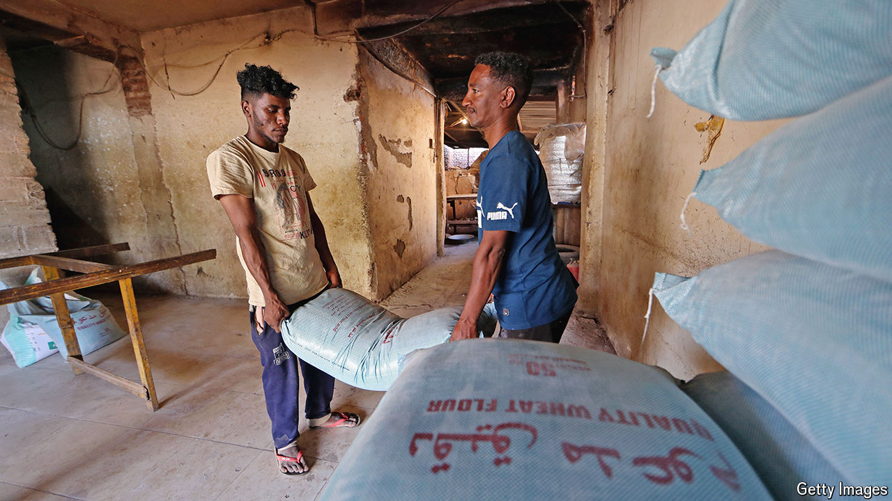

###### Markets amid madness

# How trading in war-torn Sudan survives—just 

##### Profiteering from conflict is only part of the story 

 

> Sep 12th 2024 

Vast swathes of Sudan face famine on a scale the world has not seen in decades. In Port Sudan, where perhaps 250,000 people have fled from the country’s civil war, essentials are scarce and prices are stratospheric. Yet Kinza, a sugary drink similar to Coca-Cola and manufactured in Saudi Arabia, is abundant.

