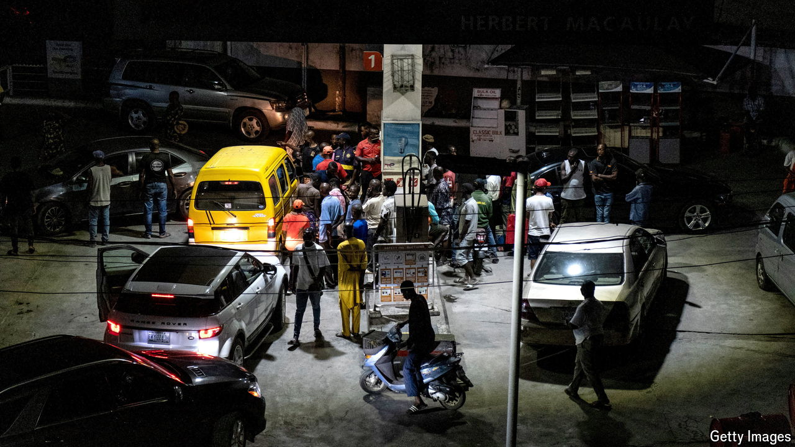

###### No petrol, no peace

# If Nigeria cannot end fuel shortages, disaster beckons 

##### A new refinery creates a chance to scrap ruinous petrol subsidies 

 

> Sep 9th 2024 

SELDOM HAS one tycoon so tantalised a nation. On September 3rd Aliko Dangote, one of Africa’s richest men, announced that his new $20bn refinery in Nigeria was starting, after many delays, to produce petrol. Nigerians are now frantically debating whether that will ease chronic fuel shortages and help pull the country of 230m people out of a destabilising . 

