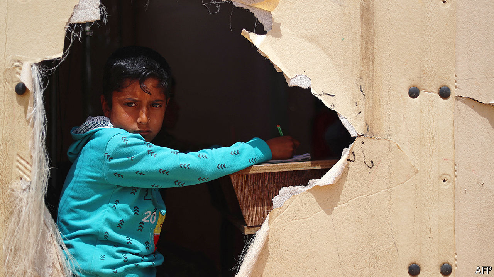

###### Falling apart

# Is Syria’s drug-dealing dictator coming in from the cold? 

##### Bashar al-Assad is less of a pariah, but cannot hold the country together 

 

> Sep 11th 2024 

At first it seemed that the opening in August of the Abu al-Zendayn crossing between rebel- and regime-held territory within Syria might herald the reconnection of the fragments of the country. On a hill outside al-Bab, north of Aleppo, rebels, protected by Turkey, and regime forces, protected by Russia and Iran, pulled back the barbed wire. Syrians displaced in the north planned long-awaited visits home. They cheered the prospect of a reprieve from smugglers’ exorbitant tariffs. Foreign governments wondered if refugees might venture back home. But a day later, shells were flying and the crossing was once again closed. 

