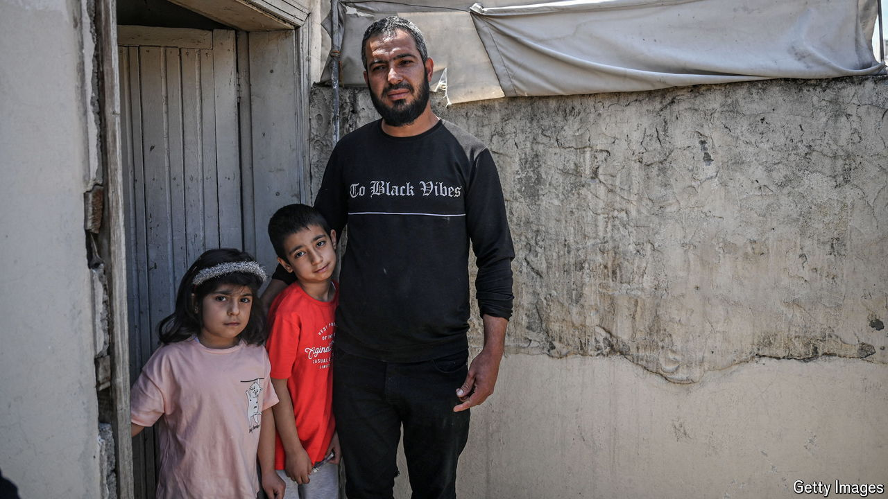

###### Not wanted here

# Turkey is trying to deport Syrian refugees back to a war zone 

##### Many Turks fear Syrian refugees will change the character of their country 

 

> Sep 12th 2024 

For the past five years similar scenes have played out each day in Esenyurt, a district in Istanbul. Every few minutes police officers frogmarch a young man onto a bus. Esenyurt is home to one of the biggest communities of Syrians in Turkey. Across the country, the authorities are rounding up undocumented migrants. Over 34,600 Syrians have been caught this year; almost all will be deported back to the war zone.

