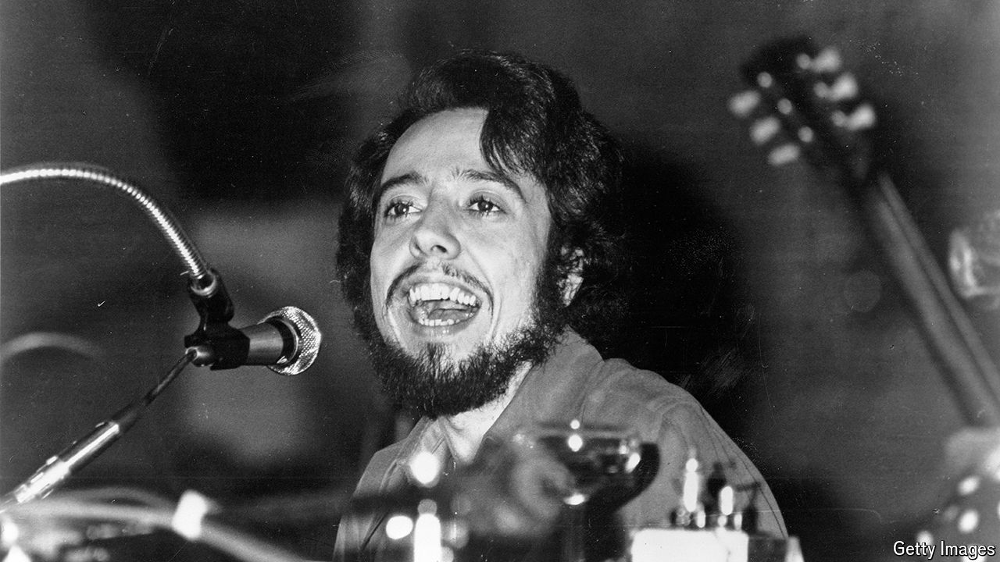

###### Samba plus sunshine

# Sérgio Mendes sent Brazil’s party spirit out into the world 

##### The pianist, arranger and bandleader died on September 5th, aged 83 

 

> Sep 11th 2024 

Over many years he had grown accustomed to the things they liked to say. That his music was “lounge”, lift, airport, cruise-liner, burbling across the aisles as shoppers debated what to buy. That it had no focus, structure or meaning, and was “easy listening” in a nutshell. Sérgio Mendes simply didn’t care. He took “easy” as a compliment, meaning the melodies were strong, and would merely flash his sunny, slightly buck-tooth smile and hunch at his piano to give them more. 

