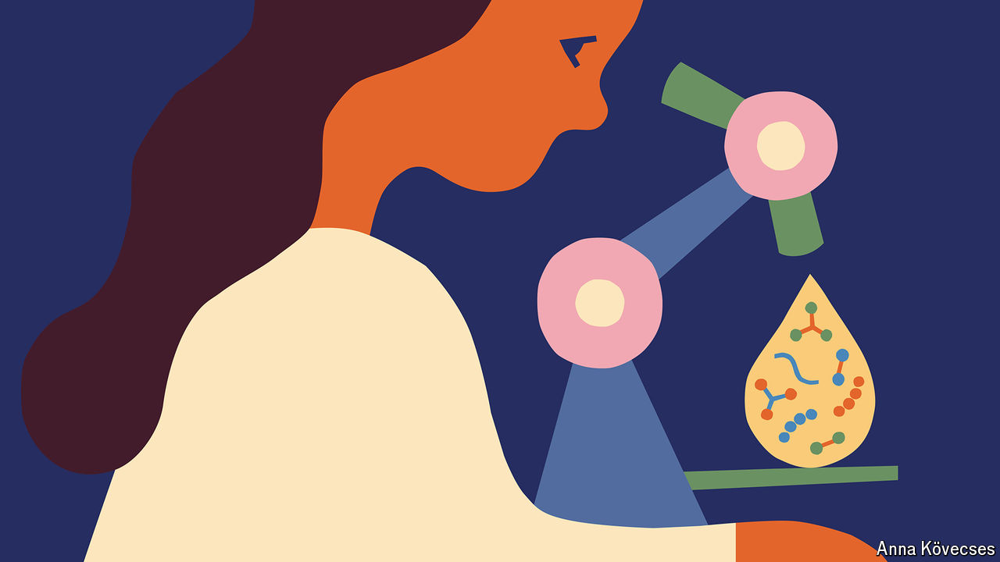

###### The motherlode

# Breast milk’s benefits are not limited to babies 

##### Some of its myriad components are being tested as treatments for cancer and other diseases 

 

> Sep 11th 2024 

IN A TALK she gave in 2016, Katie Hinde, a biologist from Arizona State University, lamented how little scientific attention was commanded by breast milk. Up until that point, she said, both wine and tomatoes had been far more heavily studied. Eight years on, alas, that remains true.

