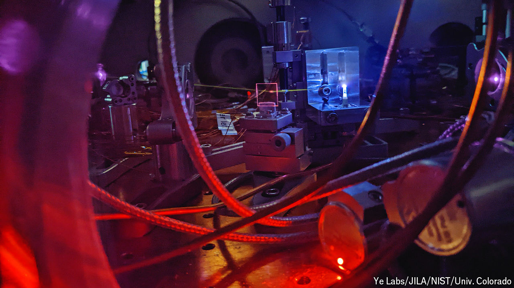

###### Tests of time

# The world’s first nuclear clock is on the horizon 

##### It would be 1000 times more accurate than today’s atomic timekeepers 

 

> Sep 11th 2024 

FOR THE discerning timekeeper, only an atomic clock will do. Whereas the best quartz timepieces will lose a millisecond every six weeks, an atomic clock might not lose a thousandth of one in a decade. Such devices underpin everything from  and  to . That may seem good enough for most. But in a paper recently published in , researchers report being ready to build its successor: the nuclear clock. Ekkehard Peik, one of the field’s pioneers, says such a clock could be a factor of 1,000 times better than today’s standard atomic clocks.

