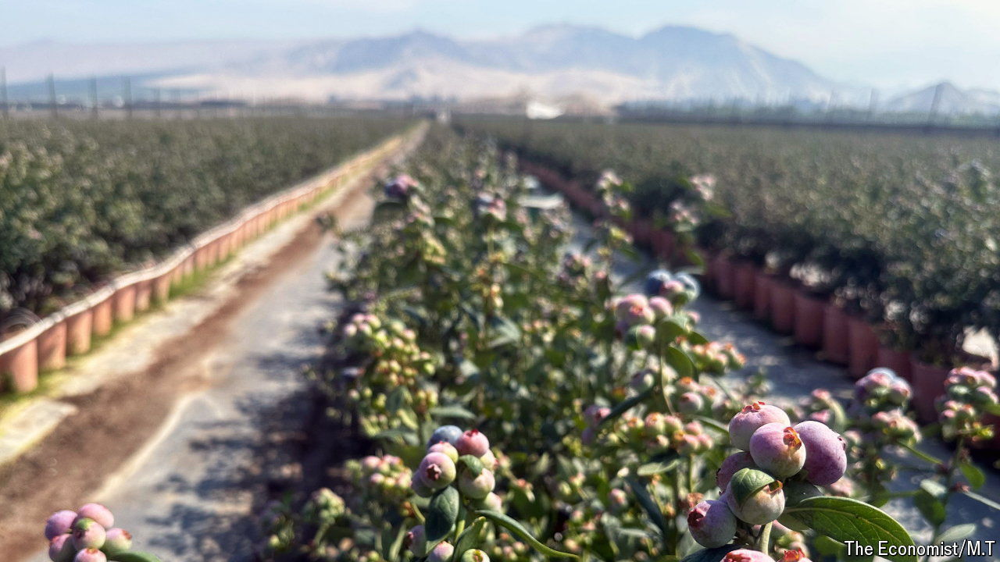

###### Blue gold

# The sweet story of Peru’s blueberry boom 

##### Plucky farmers have transformed the market in only ten years 

 

> Sep 12th 2024 

Peru’s blueberry harvest is just beginning, and Ivan Jauregui, an agronomist, looks excited. At a farm he oversees about 100km north of Lima, the capital, workers are gently twisting the fruit from their bushes. Staff in a newly built packing-plant load the best berries into refrigerated shipping containers, then pack them off to the port of Callao. Mr Jauregui says he once squeezed 35 tonnes of blueberries from a single hectare of land; he is always hoping to beat this record. “Every year we have to grow and improve,” he says.

