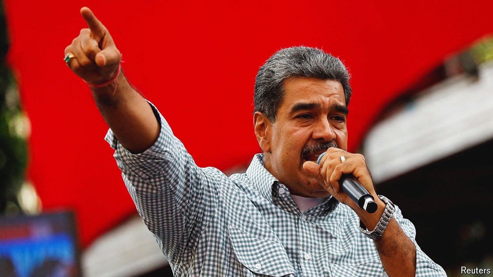

###### Dark days

# Venezuela’s opposition is getting smashed 

##### Can it find any way to thrive? 

 

> Sep 12th 2024 

In the end the pressure grew too great. On September 7th, six weeks after he won Venezuela’s presidential election in a landslide, Edmundo González fled for exile in Spain. The regime of Nicolás Maduro (pictured) had accused the affable 75-year-old former diplomat of being a “war criminal” and issued a warrant for his arrest. But its real goal was to punish the opposition for releasing data proving that Mr Maduro had lost the vote in late July. Mr González’s departure, four months before he should rightfully take office, is a crushing setback for those who are still hoping to spring Venezuela from dictatorship. 

