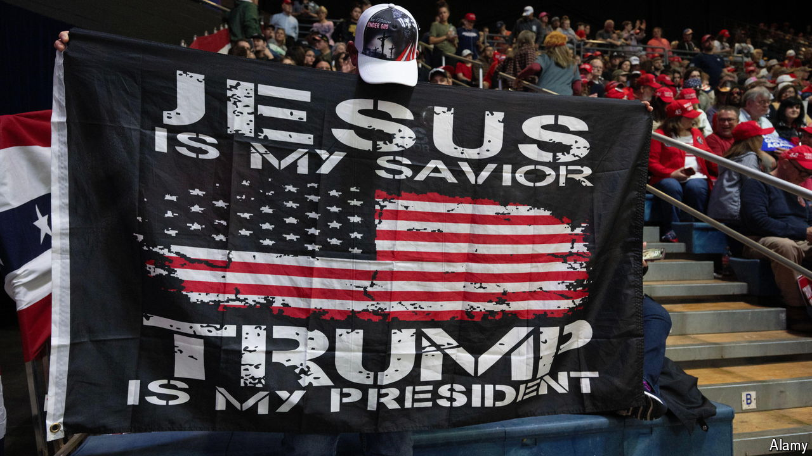

###### The Economist reads

# How Christianity shapes politics in America 

##### Four books and a podcast explain a complicated relationship 

 

> Sep 12th 2024 

IN 1791 AMERICA built a wall. The first amendment to the constitution banned the establishment of a national religion and protected freedom of worship: Thomas Jefferson called it a “wall of separation between church and state”. But there were always cracks. Since the founding of the republic, Christianity has been the religion of the majority—and many Christians have felt an obligation to bring their faith into politics. Although more and more Americans say they are not religious, almost two-thirds are Christian, according to the Public Religion Research Institute, a non-profit. In the 1980s white Christians—particularly “born-again” —emerged as a formidable voting bloc for the Republican Party. According to a survey by the Pew Research Centre, 60% of Protestants—including 81% of white evangelicals—plan to vote for Donald Trump in the presidential election in November. Here are four books and a podcast that explain the relationship between politics and Christianity in America.

