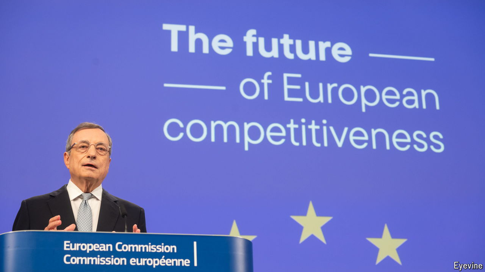

###### The world this week

# Business 

#####  

 

> Sep 12th 2024 

 released his  regarding European growth and competitiveness. Mr Draghi, who has been president of the European Central Bank and prime minister of Italy, focused on boosting innovation, calling for the EU’s countries to combine their research spending and create a new super-agency for advanced projects. As well as easing competition rules to enable consolidation, the report calls for the integration of capital markets. Mr Draghi said his recommendations were not a case of do or die, but rather one of do this, “or it’s a slow agony.”

