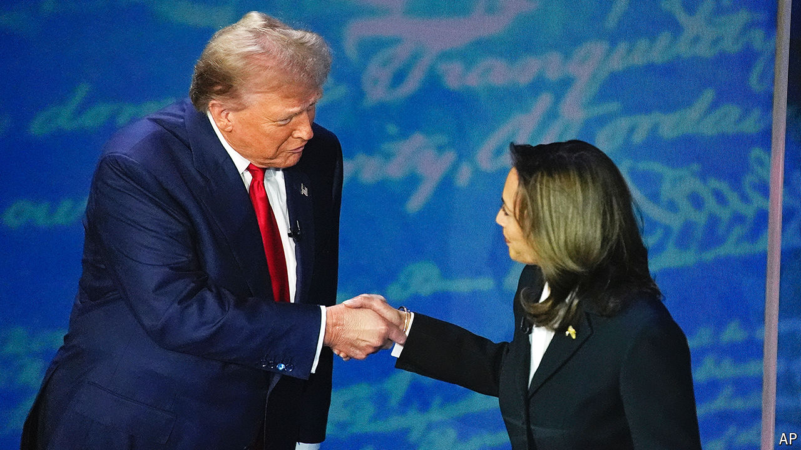

###### The world this week

# Politics 

#####  

 

> Sep 12th 2024 

Kamala Harris and Donald Trump held possibly their only  of America’s presidential campaign. Ms Harris, the vice-president, put Mr Trump on the back foot; at times he seemed to be the incumbent defending his record. Polling suggested viewers thought Ms Harris performed better than her rival. Before the event opinion polls indicated the race was tightening, and that Ms Harris’s momentum was slowing. 

