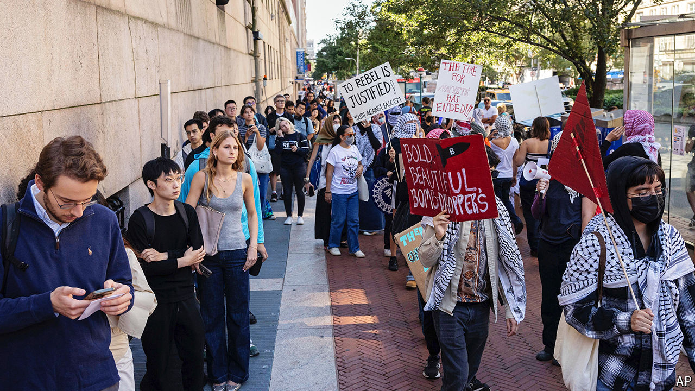

###### New term, same balancing act

# America’s college heads revise rules for handling campus protests 

##### University leaders have learnt some lessons, but face a tough test this autumn 

 

> Sep 12th 2024 

AS SOME STUDENTS shopped for Columbia hoodies and Taylor Swift crochet sets in the university bookshop, and others bought apple-cider doughnuts at a farmers’ market, it almost felt like a normal back-to-school September. But as classes resumed last week at Columbia University, the heart of last spring’s campus unrest over the war in Gaza, it was impossible to avoid renewed pro-Palestinian protests or the changes they have brought.

