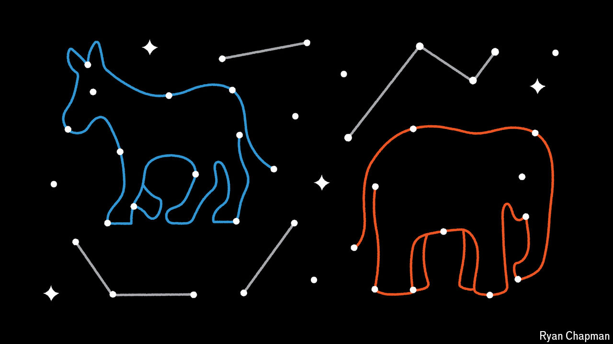

###### TikTok, tarot and Trump

# Astrologers are predicting the result of America’s election 

##### Spreading their forecasts through social media can be lucrative—and divisive 

 

> Sep 9th 2024 

DONALD TRUMP’S horoscope illuminates the laptop screen. “He’s going to enter the peak of his life in April 2025,” Helena Woods, a professional astrologer, tells your correspondent, a Pisces. The former president’s birth chart, a wheel of zodiac symbols, is a snapshot of his destiny, determined by the positions of planets across different aspects, or “houses”, of his life. That includes his relationships, his career—and the election. The exact time of Mr Trump’s birth is required for the most accurate reading. As for Kamala Harris, Jupiter and Saturn are aligning in her favour. “If she does win, I do think she might carry out two terms,” says Ms Woods.

