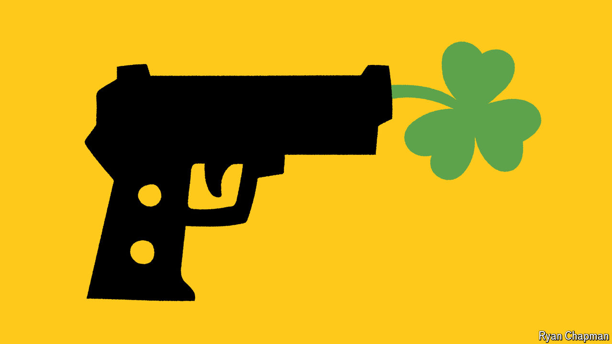

###### Wicked safe

# How Boston became the safest big city in America 

##### Murder is declining across the country, but Boston has led the way 

 

> Sep 8th 2024 

In the basement of Charles Street AME, a church in Roxbury, a historically black neighbourhood in Boston, Haseeb Hosein, the captain of the local police district, delivers the good news. “We’ve had no homicides in B2, year to date,” he says. “Keep on praying,” he says, to a chorus of “Amens”. “I can tell you, the district is going really well when we’re focusing on barbershop music, when we’re focusing on cars blasting music,” he says. “Music is my biggest community concern and I am a happy camper.”

