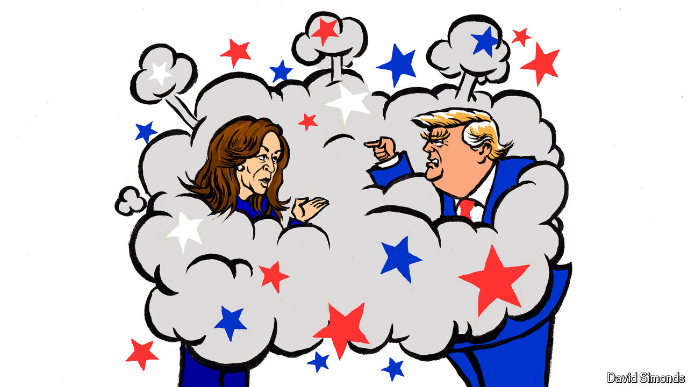

###### Lexington

# Kamala Harris makes Donald Trump look out of his depth 

##### The presidential debate was a success for the vice-president 

 

> Sep 11th 2024 

It should have been Donald Trump’s moment to shine: 26 minutes into the former president’s debate with Vice-President , a moderator asked her why the administration of President Joe Biden waited until “six months before the election” to act against illegal immigration. Ms Harris never got round to answering that question. Instead she talked about fighting people-smuggling as a prosecutor, accused  of sinking a bipartisan bill to strengthen the border and, addressing those watching at home, urged them to attend a Trump rally: they would hear him spew grievances and strange tales, she said, and they would watch as bored people got up and left. “The one thing you will not hear him talk about is ,” she concluded. 

