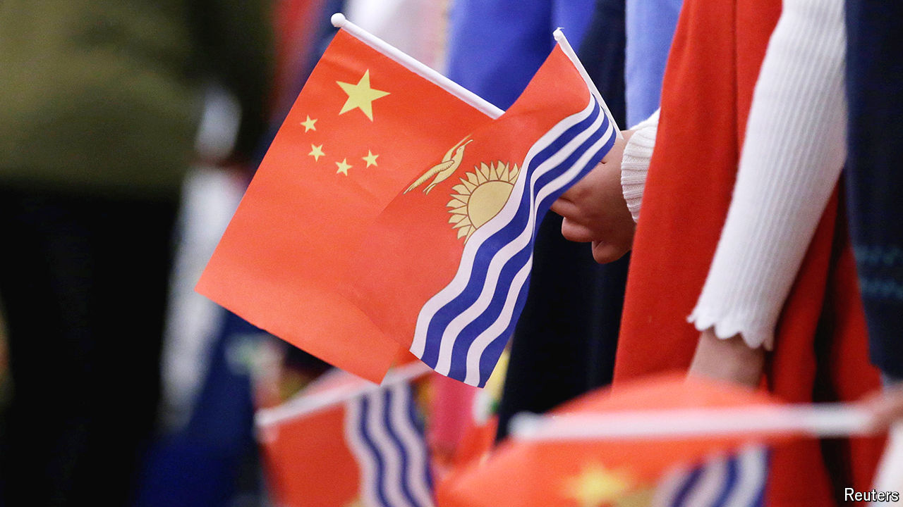

###### Not waving but plodding

# China and Australia are beefing up their Pacific policing 

##### In the competition to police the waves, who will win? 

 

> Sep 19th 2024 

A SMALL team of Chinese police has been stationed in Honiara, the Solomon Islands’ capital, since 2022, when the two countries signed a security agreement that shocked America and its allies. The cops train local officers in riot control and shooting, and give their families lessons in kung fu. Since their arrival, China’s law-and-order footprint in the Pacific region has grown. Last year it sent police advisers to Vanuatu, north-east of Australia. In February officials in Kiribati, a neighbour of Hawaii, said that Chinese police were now embedded with its forces. China’s attempts to establish police stations abroad were part of “transnational repression efforts”, said an American official. 

