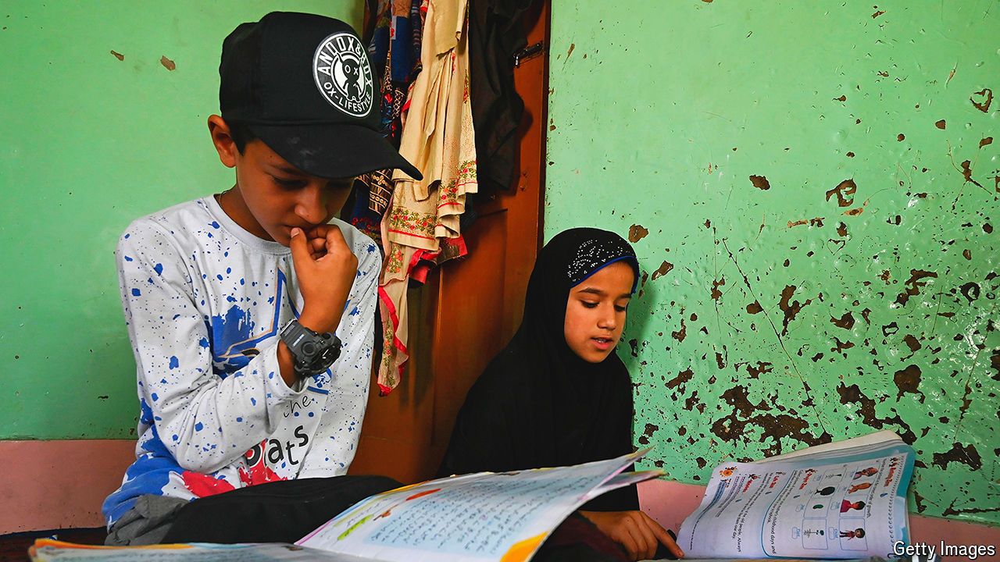

###### Cramming culture

# Private tutoring is booming across poorer parts of Asia 

##### Governments are struggling to keep up with an educational arms race 

 

> Sep 19th 2024 

The moral of the story is clear in “12th Fail”, a recent Bollywood hit about a poor farm boy, Manoj, bent on passing India’s ruthless police exam. Persevere and be richly rewarded, it suggests. Yet for a film about education and meritocracy, the portrayal of Indian schools is dismal: teacher-abetted cheating is rife at Manoj’s local school. Where he ultimately finds success, and love, is not at school, but at a jam-packed tutoring centre in Delhi.

