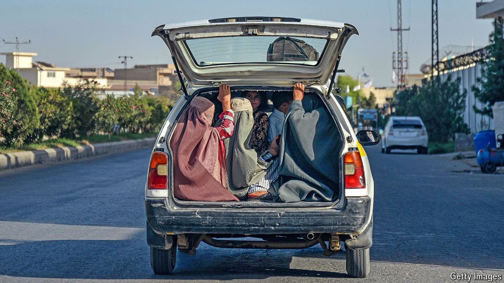

###### No country for women’s rights

# The Taliban is removing every shred of freedom from women 

##### Three years after America’s withdrawal, the situation is grim 

 

> Sep 19th 2024 

Last month the Taliban published a new consolidated code of religious laws. It has left Afghan women reeling, with many now searching for ways to leave. It also has implications for the Taliban’s quest for legitimacy and relations with the world. Three years after America’s withdrawal from the country, the situation in Afghanistan looks worse than ever. 

