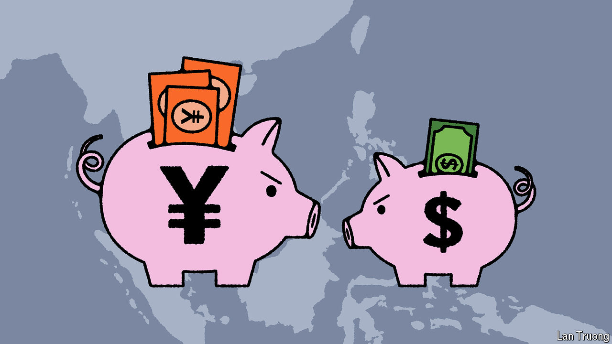

###### Banyan

# The private sector won’t save America’s Indo-Pacific policy 

##### More needs to be done to repair the economic relationship with South-East Asia 

 

> Sep 19th 2024 

America wants South-East Asians to know that it is the region’s best friend. In summits, white papers, speeches and private asides since coming to office in 2021, officials of the Biden administration have told them that America, not China, is the top source of foreign direct investment into the region. It is Uncle Sam who is going to make them rich. 

