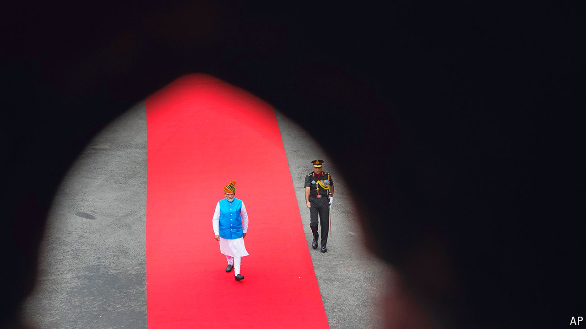

###### A weakened strongman

# What does Modi 3.0 look like? 

##### India’s prime minister is 100 days into his third term. It’s not smooth sailing 

 

> Sep 16th 2024 

For mANY Indians, the general election result in June was a  of Narendra Modi, India’s prime minister. But to hear him speak of it, that isn’t the case. He insists that, despite the loss of his party’s parliamentary majority, which has forced him to rely on coalition partners, the vote was for “continuity”. He has barely changed his cabinet since cobbling together a government. He has doubled down on pledges to turn India into a developed country by 2047, the centenary of its independence. And his Bharatiya Janata Party (BJP) is campaigning for imminent regional elections on a familiar platform of development and .

