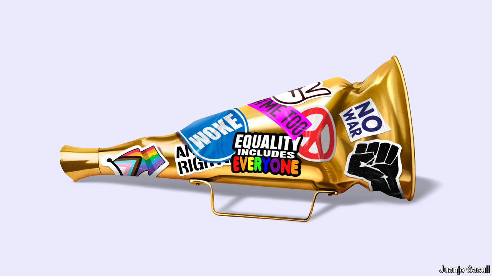

###### Back to sleep

# America is becoming less “woke” 

##### Our statistical analysis finds that woke opinions and practices are on the decline 

 

> Sep 19th 2024 

Regina Jackson and Saira Rao achieved a degree of fame at the height of the backlash in 2020 after police killed George Floyd, an unarmed black American accused of buying cigarettes with a counterfeit $20 note. For a hefty fee, rich white women would hire the pair to help them confront unconscious biases at dinner parties that featured such ice-breakers as, “Raise your hand if you’re a racist.” Guests may often have broken down in tears when told that their claims to be colour-blind were simply another brick in the edifice of white supremacy, but there was lots of interest. The two women were featured in many news reports and made a film about their dinners, “Deconstructing Karen”, in which a guilt-stricken participant confesses, “I am a liberal white woman. We are absolutely the most dangerous women.”

