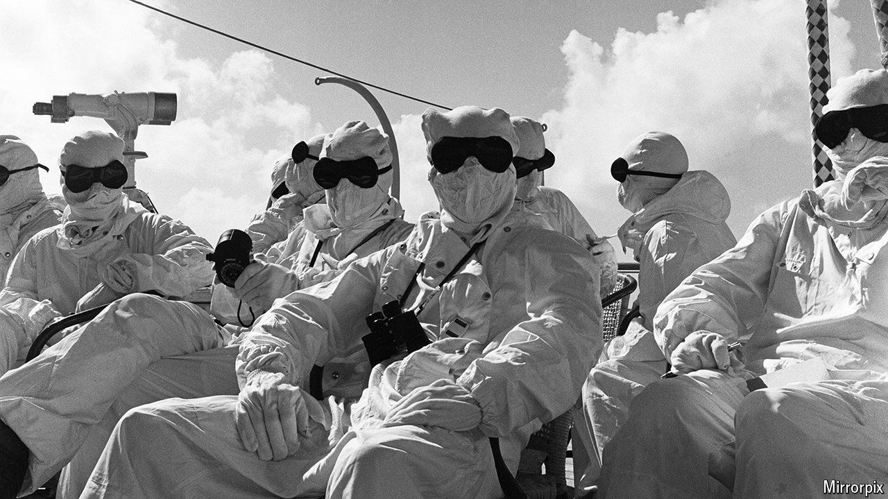

###### Atomic number

# Britain’s nuclear-test veterans want compensation 

##### Other countries have accepted the argument for redress 

 

> Sep 19th 2024 

First came a flash that lit “the sky on fire”. Then Gordon Coggon saw the bones in his hands and blood pumping through his veins, as if he were looking at an X-ray. Next he felt an intense heat, like someone was “pushing a fire through his belly”. Around him men were shouting for their mums. He soon turned to look at the dark red, blue and green mass before him. The mushroom cloud “was a very awesome sight. But frightening at the same time.”

