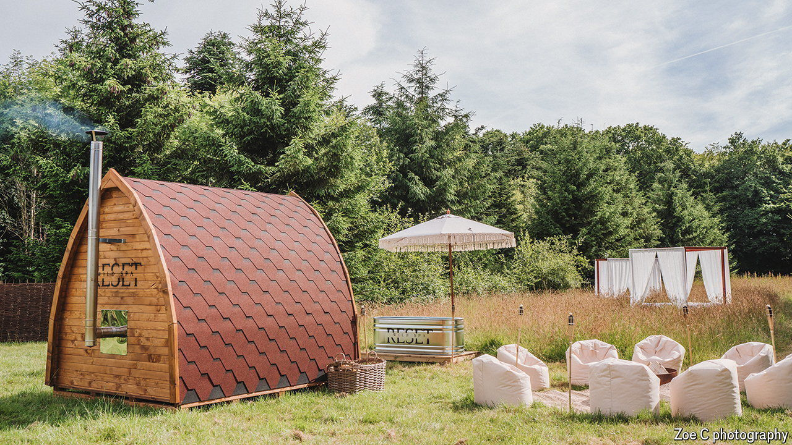

###### Photo crops

# British farms are luring the Instagram crowd 

##### More and more farmers are diversifying into hospitality 

 

> Sep 19th 2024 

Peterley Manor Farm, in the Chiltern Hills, has moved a long way from conventional farming. When Roger Brill, a fourth-generation farmer, and his wife, Jane, took over the derelict turkey farm in 1982, they set out to grow and sell fruit and vegetables from the farm gate. Now the 40-acre farm boasts a “wild spa” with outdoor ice baths and a log-fired sauna, yoga classes in a Mongolian yurt and a café in a converted tractor barn. Produce from the fields, including Christmas trees and apple juice, accounts for a vanishingly small share of the farm’s income. It made up less than a tenth of revenue last year. 

