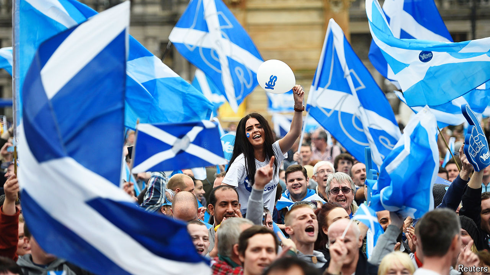

###### Good times

# Ten years on from Scotland’s independence referendum 

##### The 2014 campaign has been mythologised by nationalists 

 

> Sep 18th 2024 

Ten years ago George Square in Glasgow buzzed with campaigners for Scottish independence. The anniversary of , which fell on September 18th, passed somewhat more discreetly. Scottish political leaders made pro forma speeches. Bob Doris, a Scottish National Party (SNP) politician representing north-east Glasgow, says that activists planned to talk to local people about the anniversary, but delicately: “We’ll do it very quietly, in a dignified fashion.” 

