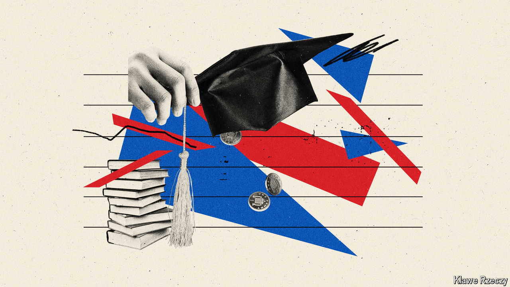

###### Grads and grind

# The broken business model of British universities 

##### Frozen fees + fewer foreigners = big trouble 

 

> Sep 17th 2024 

The Labour Party barely talked about higher education in the run-up to the general election in July. In government, universities’ problems are harder to ignore. In a dour speech on September 10th Sir Keir Starmer, the prime minister, included  among a list of public services that he said were “crumbling” and “worse than we expected”. 

