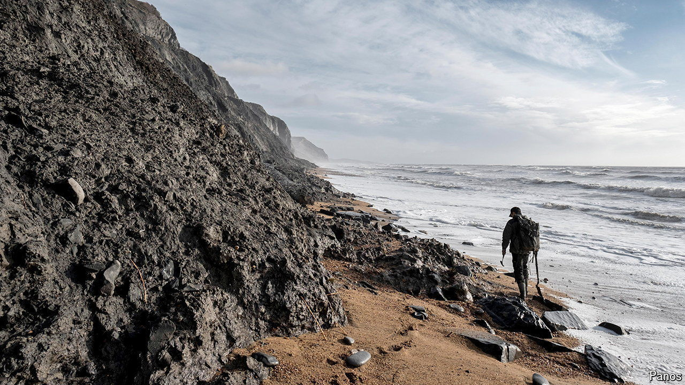

###### Rock and goal

# Treasure-hunting on England’s Jurassic Coast 

##### Fossils on a conveyor belt 

 

> Sep 16th 2024 

Along a stretch of England’s southern shoreline, gangs of small children roam the beaches wielding hammers and searching for remains in the rocks. This is not some post-apocalyptic scene, a day at the seaside via , but the mark of an increasingly popular pastime. 

