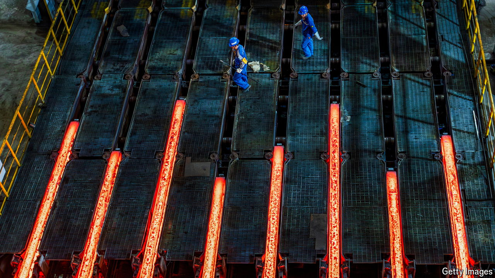

###### Smelted

# Chinese overcapacity is crushing the global steel industry 

##### Governments are stepping in to protect local producers 

 

> Sep 17th 2024 

Each year China makes as much steel as the rest of the world combined. The vast scale of its output—around 1bn tonnes a year—is obscured by the fact that most of it stays in the country. Lately, however,  of the metal have surged, reaching 90m tonnes in 2023, up by 35% on the previous year (see chart 1). That may be a fraction of China’s total production, but it is more than what America or Japan make in a year. And it is enough to build a thousand Golden Gate bridges. 

