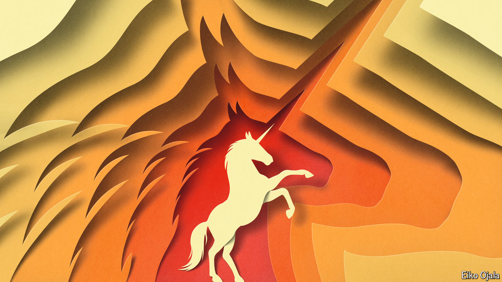

###### The age of the hectocorn

# Generative AI is transforming Silicon Valley 

##### The technology is forcing America’s disrupters-in-chief to think differently 

 

> Sep 19th 2024 

A rare beast may soon lumber across the hills of Silicon Valley: not a $1bn unicorn, nor a $10bn decacorn, but a hectocorn—a startup valued at more than $100bn. OpenAI, the maker of ChatGPT, is understood to be in talks to raise $6.5bn from investors to fund the expansion dreams of its co-founder, Sam Altman. If it pulls off the deal, OpenAI’s valuation will be about $150bn, making it only the second ever $100bn-plus startup in America after SpaceX, a rocketry giant led by Elon Musk (who co-founded OpenAI in 2015 and is now Mr Altman’s nemesis). 

