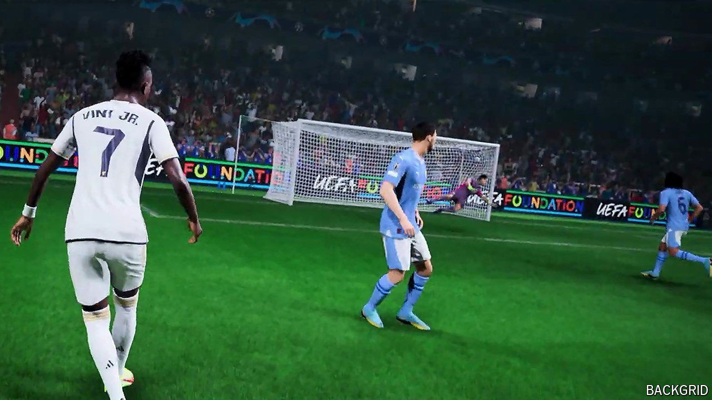

###### It’s in the game

# How FIFA was outplayed by Electronic Arts 

##### The video-game publisher called the football chiefs’ bluff—and won 

 

> Sep 19th 2024 

A new football season will begin on September 27th: not the Premier League or La Liga, but the annual update of the world’s favourite football video-game. “FIFA”, as the franchise was known from its pixelated debut in 1993, sells nearly 30m copies a year. In-game spending pushes its annual revenue above $3bn, estimates MoffettNathanson, a firm of analysts, which calculates that the title contributes nearly two-thirds of the profit of its publisher, Electronic Arts (EA). Gaming has few bigger names than “FIFA”.

