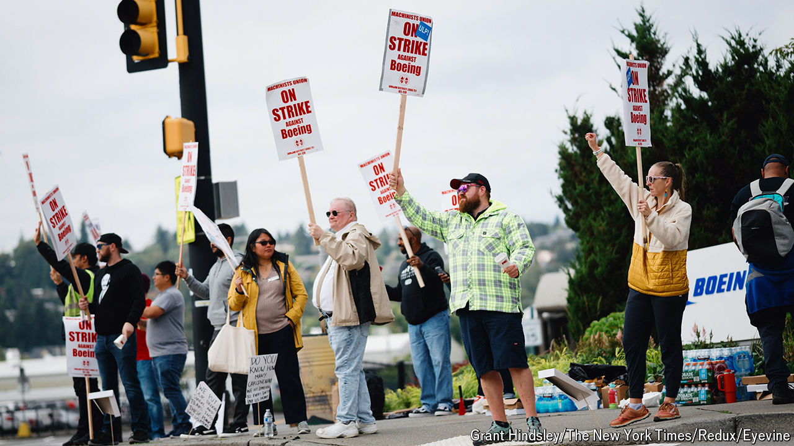

###### Flying pickets

# How much trouble is Boeing in? 

##### A protracted strike could cause lasting damage 

 

> Sep 19th 2024 

When Kelly Ortberg landed in the chief executive’s chair at Boeing last month the list of problems he had to confront at the aerospace giant was already daunting. Production of the 737 MAX passenger jet, Boeing’s most important product, has been curtailed after a mid-flight blowout of a fuselage panel in January. Production of the larger 787 Dreamliner has also slowed down owing to supply-chain problems. Plans to launch the even bigger 777X are years behind schedule. Add to that losses at Boeing’s usually lucrative defence division and an embarrassing software failure that left astronauts piloting its Starliner spacecraft stranded on the International Space Station and some may wonder why Mr Ortberg took the job.

