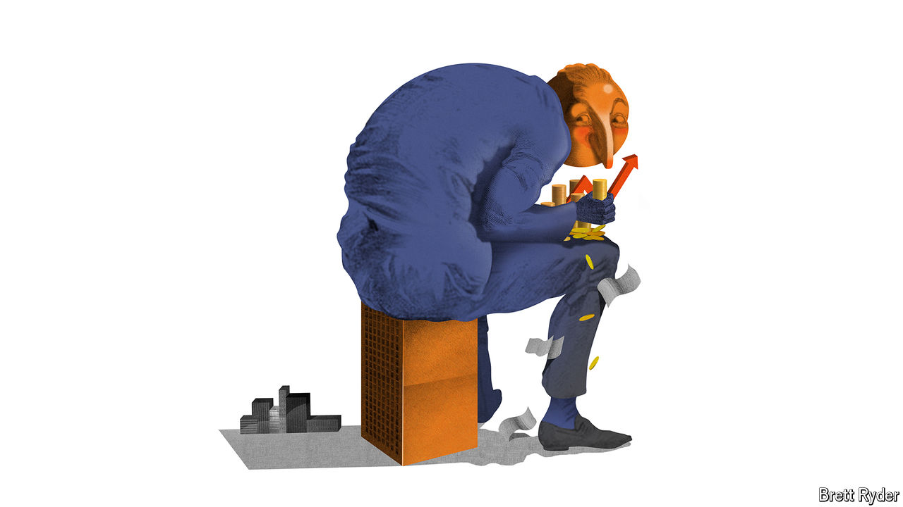

###### Schumpeter

# PwC needs to rethink its global governance 

##### The “big four” accounting giants have outgrown their decentralised structures 

 

> Sep 19th 2024 

LIKE HIS fellow Victorian beancounters, Edwin Waterhouse made his name in part by unearthing frauds perpetrated during the railway mania that gripped late-19th-century Britain. These days the accounting-and-consulting powerhouse that traces its history to his successful sleuthing more often makes news for failing to detect financial malfeasance—or for engaging in mischief itself. Between 2010 and 2023 it faced around $450m in fines and settlements related to botched audits and other misconduct in various countries. The firm, which now goes by PwC rather than PricewaterhouseCoopers, at least spares Edwin’s memory the indignity of having his name openly tied to the mess.

