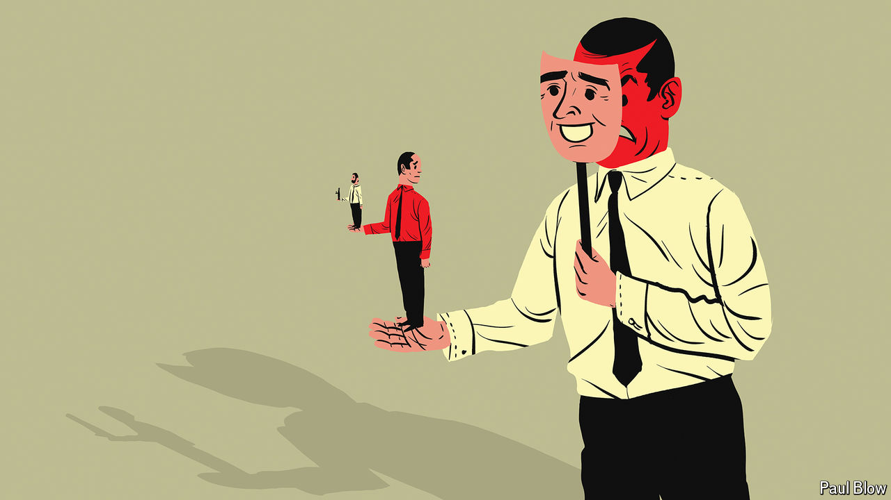

###### Bartleby

# Should you be nice at work? 

##### Kindness is in vogue 

 

> Sep 19th 2024 

Kindness is in the air. Publishers produce business books with titles like “The Power of Nice” or, simply, “Kind”. LinkedIn, which is ostensibly a networking site for career-minded professionals, is overrun with sickly videos showing people being improbably generous to the homeless. Firms publicly embrace the values of compassion: one manufacturer of safety-gear talks of “offering grace internally”, which sounds terribly intrusive. 

