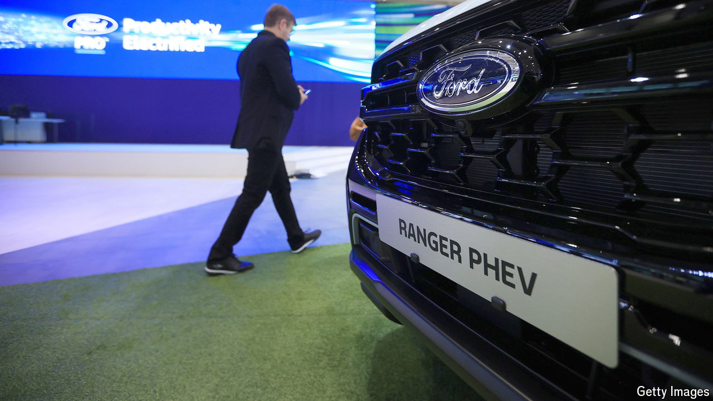

###### On a detour

# Why the hype for hybrid cars will not last 

##### Fully electric vehicles will win the race 

 

> Sep 17th 2024 

The car industry’s effort to decarbonise revolves around replacing petrol with . A growing number of customers want both. Buyers who cannot afford a , or worry about the availability of charging points, are turning to plug-in hybrid electric vehicles (PHEVs), sales of which are rocketing. But the hype for hybrids may prove to be short-lived.

