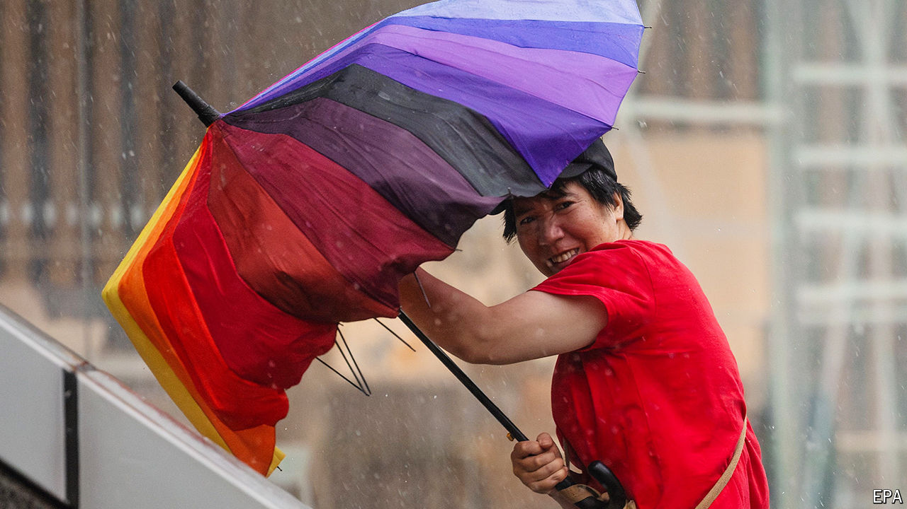

###### Battered

# A typhoon hits Shanghai and the Chinese economy groans 

##### Consumers are stuck inside during a three-day holiday 

 

> Sep 19th 2024 

Shanghai was hit by Typhoon Bebinca on September 16th. Hundreds of thousands of residents were evacuated in what state media called the strongest storm to rip through the financial hub in 75 years. Fierce winds uprooted trees and toppled billboards. The weather also disrupted the three-day mid-autumn festival. Officials had hoped to see a big increase in consumption during the holiday. Faced with a sluggish economy, the government is encouraging people to spend more. But Shanghai’s residents were stuck inside during much of the festival. Even elsewhere, consumer demand has been soggy.■

