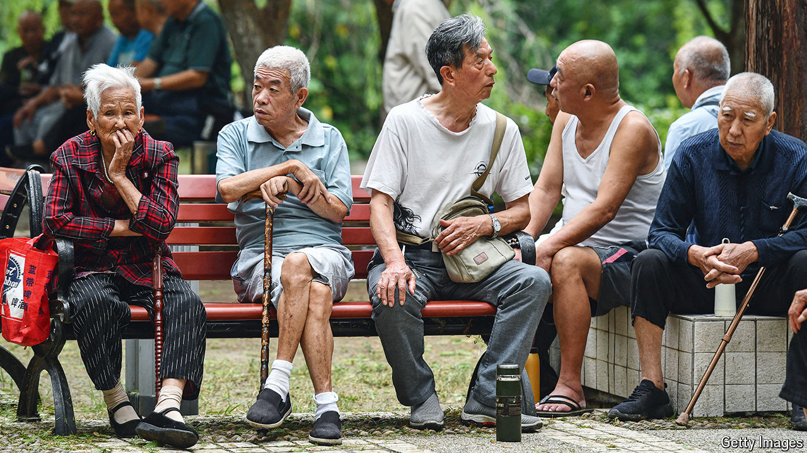

###### Sunset delayed

# Anger abounds as China raises its strikingly low retirement age 

##### Old people will have to toil a little longer, assuming they can keep their jobs 

 

> Sep 17th 2024 

CHINA’S LEADER, Xi Jinping, boasts that his political system has a matchless ability to get difficult things done. “For anything that benefits the party and the people,” he has said, “we must act boldly and decisively.” Yet it was not until September 13th, after years of indecision, that China announced the first raising of its retirement age since the 1950s. From , it will begin to creep closer to rich-world norms.

