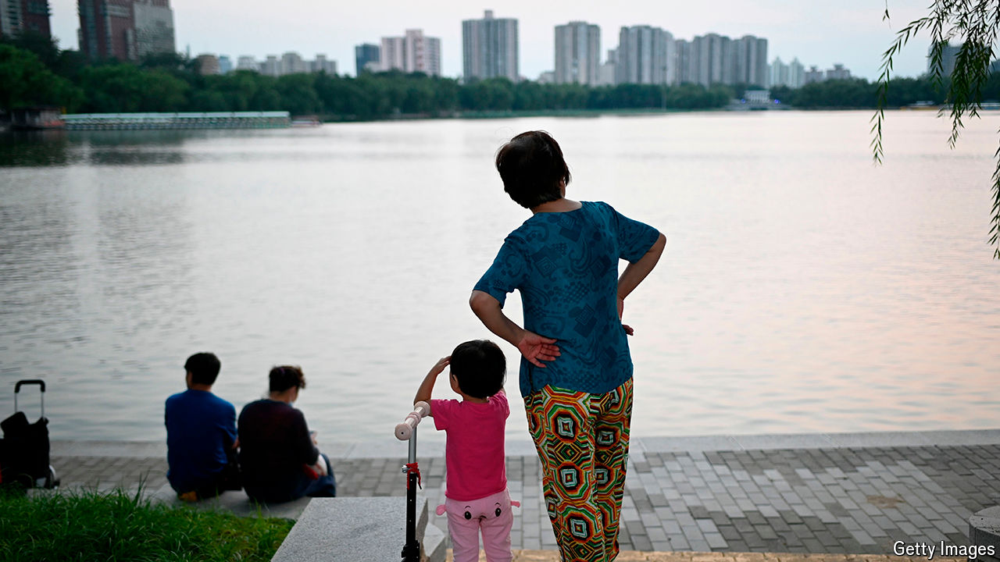

###### The trade-off

# By raising the retirement age, has China created a care crisis? 

##### Older women tend to look after the country’s young children 

 

> Sep 19th 2024 

CHINA’S PENSIONS are underfunded and its population is getting older. So the government’s recent decision to raise the  seemed overdue. But it may create other problems, most notably in the field of child care. And these challenges may lead young people to have fewer babies, exacerbating the country’s demographic crisis.

