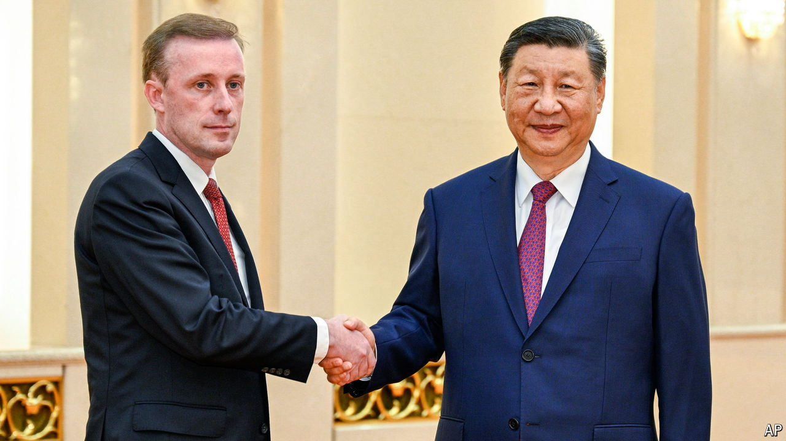

###### Heading home

# China has freed an American pastor. Does it want anything in return? 

##### The move followed much pleading by American officials 

 

> Sep 19th 2024 

David Lin had been trying to help an underground Christian group build a church in Beijing when he was detained by the Chinese government in 2006. The ruling Communist Party does not look kindly on spiritual activities it does not control. So Mr Lin, an American pastor, was charged with contract fraud, a common pretext for jailing religious leaders. As expected, he was convicted and condemned to life in prison. Though his sentence was later reduced, he was not due to be released until 2029.

