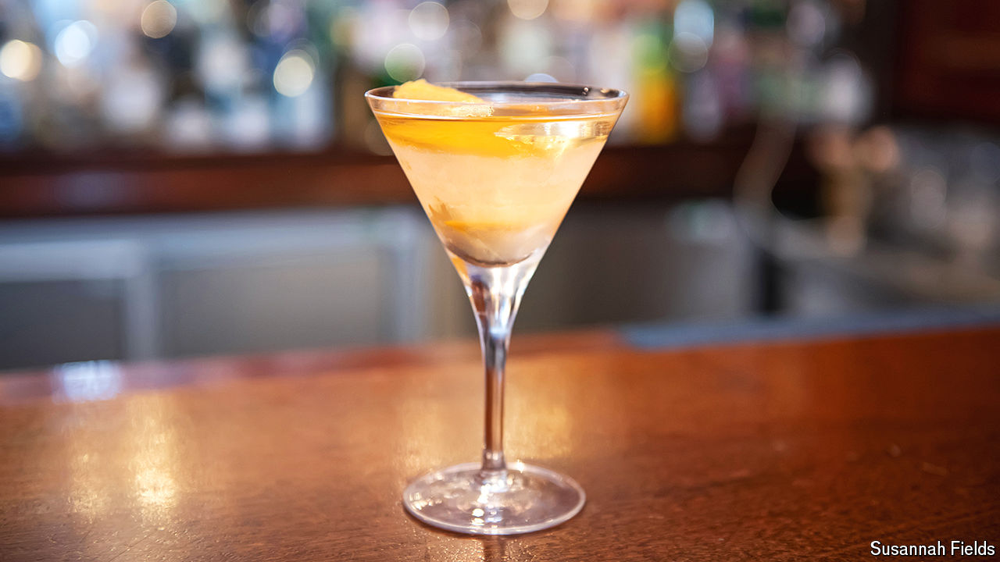

###### World in a dish

# How the martini became the world’s most iconic cocktail 

##### It has a glamorous history and can be endlessly personalised 

 

> Sep 19th 2024 

AT DUKES BAR in London there is a limit of two martinis per person. Enrico Chiappini, the head bartender, says that in his 16 years he has made almost no exceptions. That is because the bar’s martinis, made with chilled gin or vodka and vermouth, are famously dangerous: each contains 120ml of booze. Two hold ten shots. 

