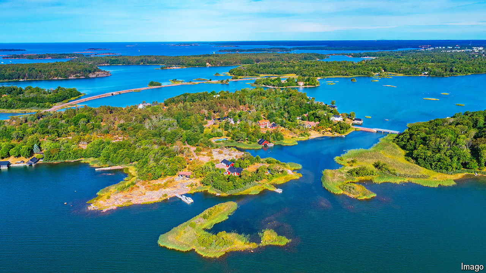

###### Temptation islands

# Aland is lovely, weapon-free and too close to Russia 

##### Finland worries the demilitarised islands could fall prey in a conflict 

 

> Sep 19th 2024 

“Everything has become more intense,” murmurs Juri Jalava as his coastguard cutter plies the waters of the Aland Islands. Tension with Russia means he is spending longer at sea than ever: “We do not want to be caught out.” Aland, a Skye-sized island surrounded by 7,000 islets and rocks, is awkward for Finland. Over 95% of its trade passes through or near the islands, as do crucial data and electricity cables linked to the rest of Europe. But Finland is bound by treaty to keep these Swedish-speaking islands demilitarised in peacetime. They have been so since the Crimean War, when Britain and France tried to strangle Russian trade through the Baltic. 

