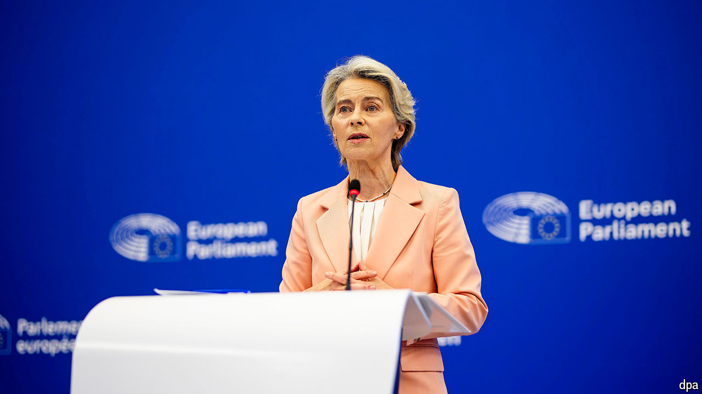

###### Brussels reboot

# Can a new crew of European commissioners revive the continent? 

##### Ursula von der Leyen picks her team 

 

> Sep 19th 2024 

For a sense of what Europeans fret about, look at the job titles given to European commissioners in Brussels. Five years ago a Greek official was put in charge of “protecting our European way of life”—a job that largely entailed keeping migrants out. (After a furore he was merely asked to “promote” this elusive way of life.) The recurring theme of the job titles handed out to a new set of commissioners on September 17th is that the European Union is now fretting about its place in the world, particularly its economy. One commissioner has been asked to look after not just trade but also “economic security”, another aims to promote “tech sovereignty”, yet another to deliver “prosperity”. To add to the anxious vibe, for the first time the bloc will have a straight-up defence commissioner.

