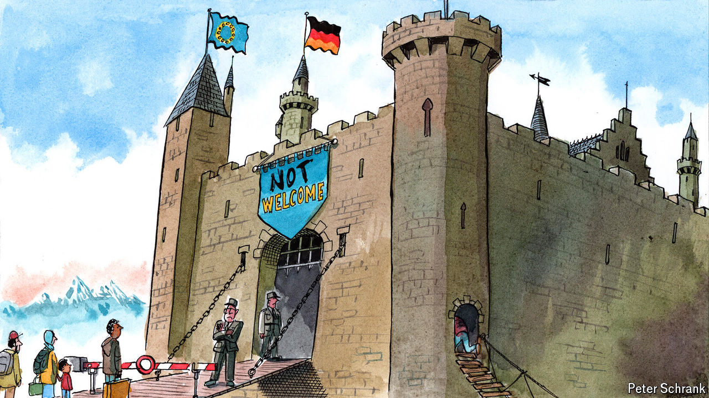

###### Charlemagne

# Europe is bidding a steady farewell to passport-free travel 

##### Germany is the latest Schengen country to reintroduce border checks 

 

> Sep 19th 2024 

Staring out over France and Germany from the vine-covered hills of Schengen, a village at the southern tip of Luxembourg, it is hard to tell where one country ends and the other begins. That is in no small part thanks to a deal signed there in 1985, which committed the Benelux countries, France and Germany to abolish the frontiers separating them. The Schengen passport-free travel area has since grown to include most of the 450m citizens of the European Union’s 27 countries, and some neighbours too. Keen to capture the mysterious essence of Euro-federalism, a trickle of tourists still flock to the village where it all started, as Charlemagne did this week. Alas, visitors face three kinds of disappointment. First, a museum celebrating the agreement is currently under renovation. Second, the village has turned into a Saudi prince’s fantasy: with just a few hundred inhabitants, it has eight sprawling petrol stations in its vicinity, serving motorists keen to fill their tanks before leaving low-tax Luxembourg. Finally, and most distressingly, the freedom of travel that put the place on the map is steadily being chipped away. A symbol of the EU’s success at bringing countries together risks succumbing to reinvigorated nationalism across the bloc.

