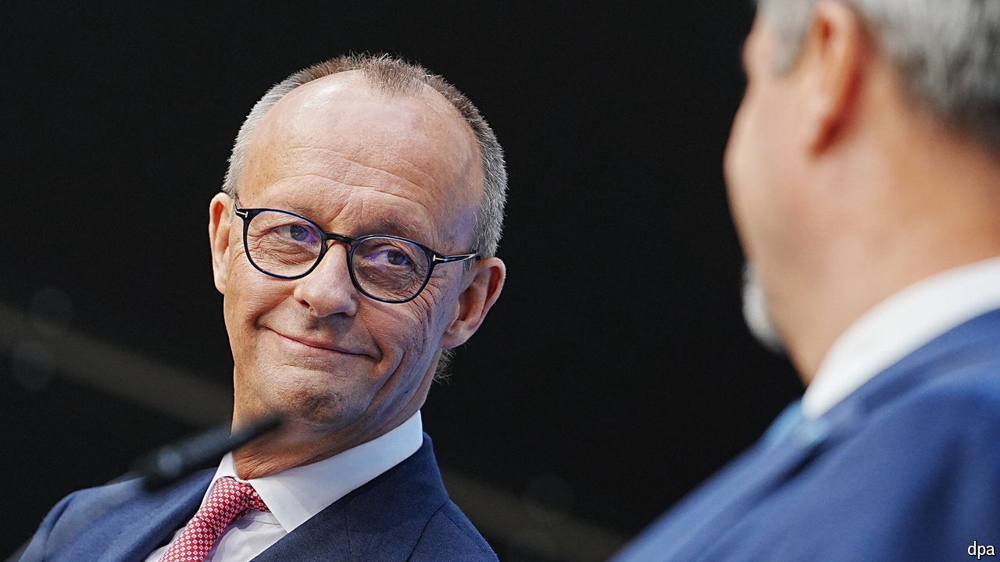

###### Friedrich the Great

# Germany’s conservatives choose the country’s probable next leader 

##### Friedrich Merz is in pole position to take over as chancellor at the election in 2025 

 

> Sep 17th 2024 

“FRIEDRICH MERZ is doing it, and I’m fine with that.” This brief statement by Markus Söder, the head of Bavaria’s governing Christian Social Union (CSU), was enough to confirm what had long been clear in German political circles: that Mr Merz, leader of the centre-right Christian Democratic Union (CDU), the CSU’s larger sibling, would be the parties’ joint candidate at next year’s federal election. Mr Merz will thus lead the opposition conservatives’ bid to unseat Olaf Scholz, the Social Democratic (SPD) chancellor.

