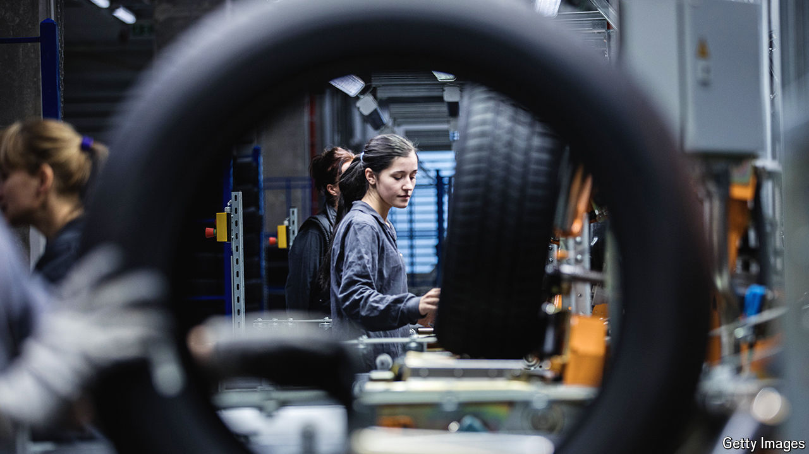

###### Bringing it all back home

# Near-shoring is turning eastern Europe into the new China 

##### With firms moving production closer to market, CEE is the place to be 

 

> Sep 19th 2024 

The european union has tried hard lately to restrict Chinese imports. Yet this summer China made it easier to import one European product: Polish poultry. The gesture was economically insignificant. But it is part of a broader push by China to cultivate and invest in central and eastern Europe (CEE). 

