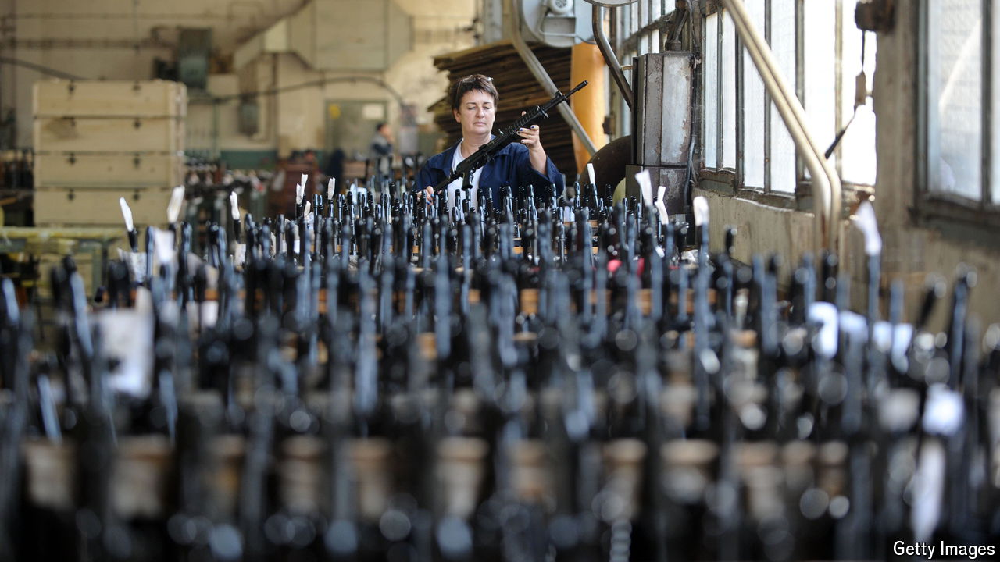

###### The cogs of war

# Ukraine is a booming market for Balkan arms makers 

##### It’s not just gangsters buying Serbian and Bosnian ammo these days 

 

> Sep 19th 2024 

Terrorists and gangsters enjoyed a weapons bonanza after the breakup of Yugoslavia in the 1990s. Now it is Western governments’ turn. With war raging in Ukraine, they are hoovering up the region’s ammunition and mortars. Western Balkan arms-makers are booming. Serbian arms exports have quadrupled since 2020; some €800m ($890m)-worth of its ammo has gone to Ukraine since the invasion. Bosnia’s exports in the first four months of 2024 nearly doubled compared with the same period last year. Its ammunition factories are working around the clock, says Jasmin Mujanovic of the New Lines Institute for Strategy and Policy, a think-tank. 

