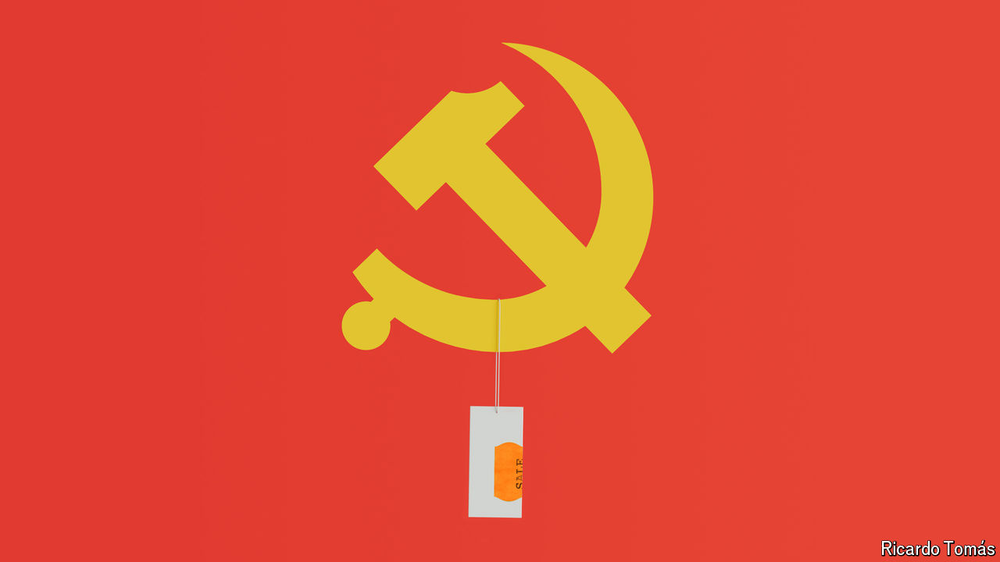

###### Smashing pots, selling iron

# How China’s communists fell in love with privatisation 

##### Even though they are not very good at it 

 

> Sep 15th 2024 

On a recent visit to his hometown of Laixi, in eastern China, Guo Ping received a shock: the local government had sold off a number of state-owned assets, including two reservoirs. The small city’s finances, as well as those in the neighbouring port of Qingdao, were under strain, forcing officials to come up with new sources of revenue. This meant hawking even large bits of regional infrastructure. The sales seemed to be part of what Mr Guo, who asked to use a pseudonym, views as a gradual economic deterioration. 

