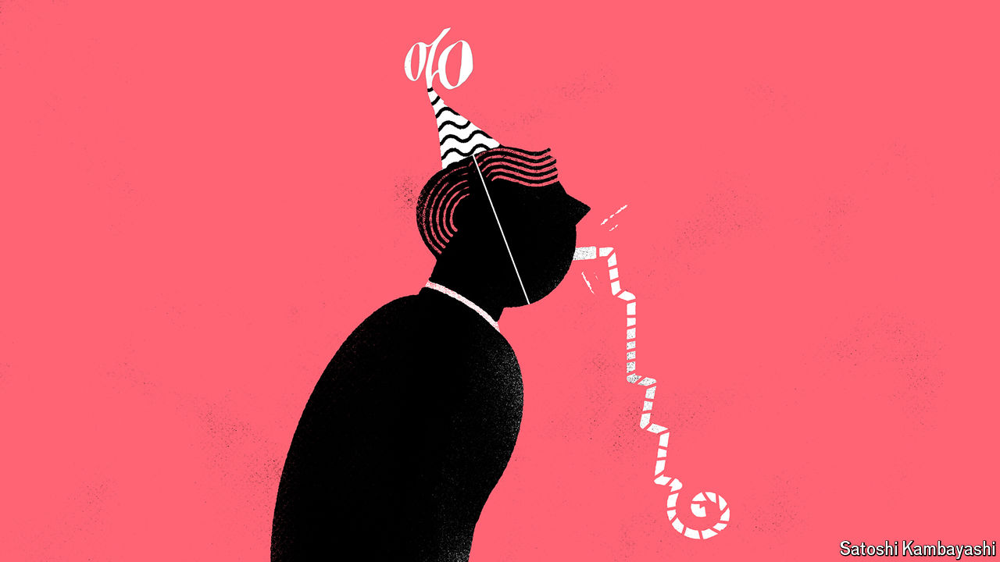

###### Buttonwood

# The Federal Reserve’s interest-rate cuts may disappoint investors 

##### Jerome Powell could still surprise on the hawkish side 

 

> Sep 16th 2024 

The longed-for . For two and a half years, ever since America’s Federal Reserve embarked on its fastest series of interest-rate rises since the 1980s, investors had been desperate for any hint of when it would reverse course. But by the time Jerome Powell, the central bank’s chair, announced the first such reduction on September 18th, the debate among traders was no longer “whether” but “how much”. Weeks beforehand, at an annual gathering of central bankers in Jackson Hole, Wyoming, Mr Powell had already more or less confirmed that a cut was imminent. In the event officials plumped for a jumbo-sized chop, of 0.5 percentage points, to between 4.75% and 5%. 

