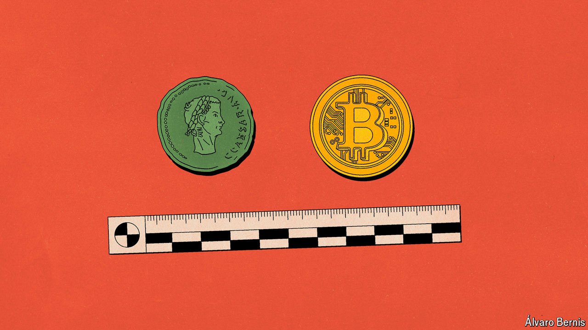

###### Free exchange

# What the history of money tells you about crypto’s future 

##### The thread from shipwrecks and sheep flocks to digital currencies 

 

> Sep 19th 2024 

This month China’s central bank revealed that its digital currency, the e-CNY, had been used for 7trn-yuan-worth of transactions in its short life—an amount equivalent to almost $1trn. China is not alone. Over 130 countries are exploring digital currencies, according to the Atlantic Council, a think-tank. Proponents of official digital currencies believe that a combination of ubiquitous smartphones, innovative cryptography and vast computing power means it is possible to remake the financial system.

