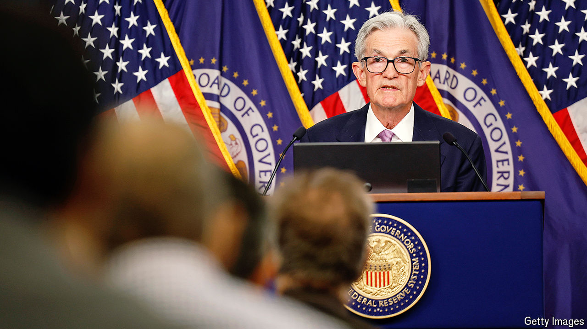

###### Ignoring the noise

# Why the Federal Reserve has gambled on a big interest-rate cut 

##### The bold move carries economic and political risks 

 

> Sep 18th 2024 

The Federal Reserve’s decision on September 18th to  by half a percentage point, to between 4.75% and 5%, is momentous. As the first cut by America’s central bank since it lifted rates to quell inflation, the shift marks the start of a monetary-easing cycle. It also represents a bet that inflation will soon be yesterday’s problem and that action is required to support the labour market. For the first time since 2005, one of the Fed’s governors in Washington dissented from the decision. Michelle Bowman preferred to cut rates by a quarter-point.

